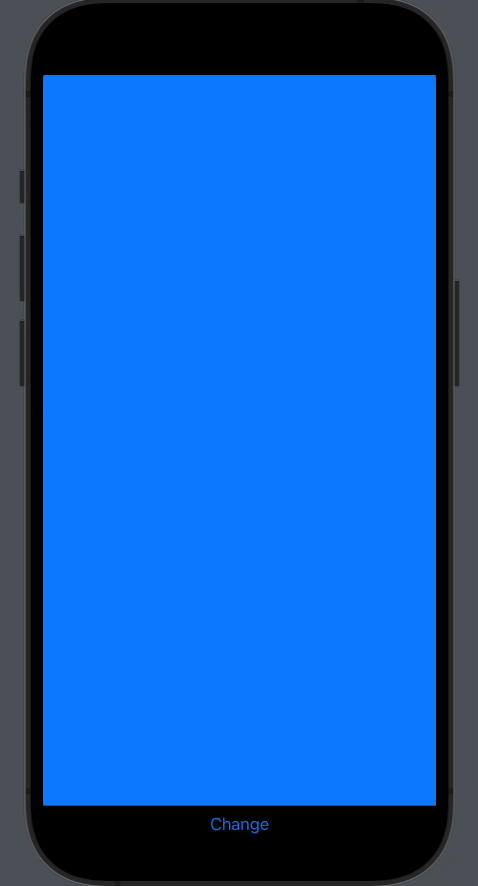

# CustomPagerView

A brand new PagerView for SwiftUI with customs transitions styles. 



### Initialization

- `axis`: Scroll Axis.
- `transition`: Transition style.
- `index`: Binding for selection index.
- `animation`: Animation for changes.
- `content`: ViewBuilder for content of PagerView.
                       

 ```swift
    PagerView(axis: PagerViewAxis = .horizontal,
                       transition: PagerViewTransition = .cube,
                       index: Binding<Int> = .constant(.zero),
                       animation: Animation = .default,
                       @ViewBuilder content: () -> TupleView<Views>)
  ```

### Axis
 ```swift
    public enum PagerViewAxis {
        case vertical
        case horizontal
    }
  ```

### Transition

 ```swift
    public enum PagerViewTransition {
        case smooth
        case cube
        case custom(PagerViewCustomTransition)
    }
  ```
  
- `Custom transitions`: You can create customs transitions with this protocol, and passing it to .custom().
      
   ```swift
    public protocol PagerViewCustomTransition {
    func getModifier<Content: View>(view: Content,
                                        index: Int,
                                        offset: CGFloat,
                                        geometry: GeometryProxy,
                                        axis: PagerViewAxis) -> any View
    }
  ```
    
