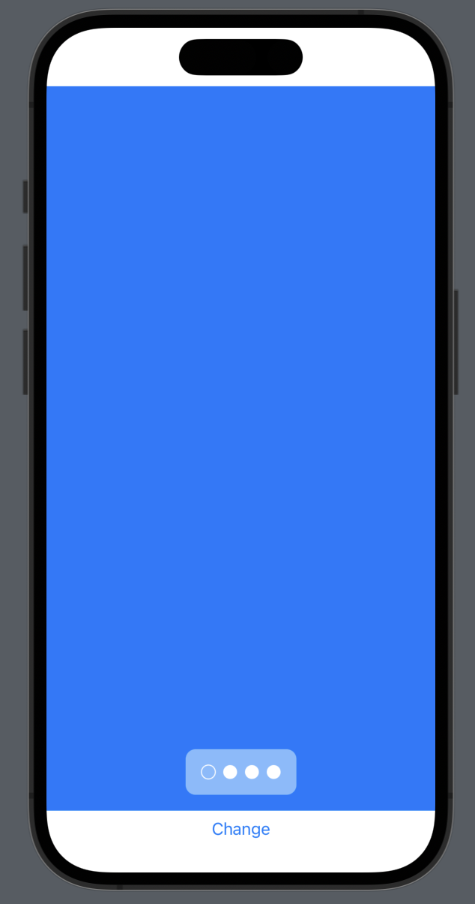

# CustomPagerView

A brand new PagerView for SwiftUI with some transition styles like cube transition. Also prepared to create customs transitions.


### Initialization

- `axis`: Scroll Axis.
- `transition`: Transition style.
- `index`: Binding for selection index.
- `animation`: Animation for changes.
- `clipScrollEnd`: Clip scroll if it is in the end of the content.
- `content`: ViewBuilder for content of PagerView.

```swift
PagerView(axis: PagerViewAxis = .horizontal,
        transition: PagerViewTransition = .cube,
        index: Binding<Int> = .constant(.zero),
        animation: Animation = .default,
        clipScrollEnd: Bool = true,
        @ViewBuilder content: () -> TupleView<Views>)
```

### Axis
```swift
public enum PagerViewAxis {
    case vertical
    case horizontal
}
```

### Transition

```swift
public enum PagerViewTransition {
    case smooth
    case cube
    case custom(PagerViewCustomTransition)
}
```
  
- `Custom transitions`: You can create customs transitions with this protocol, and passing it to .custom().

```swift
public protocol PagerViewCustomTransition {
    func getModifier<Content: View>(view: Content,
        index: Int,
        offset: CGFloat,
        geometry: GeometryProxy,
        axis: PagerViewAxis) -> any View
}
```
    
### PagerControl

If you want to add a pager control to the view, you can add this function when creating the PagerView.

```swift
func addPagerControl(alignment: Alignment = .center,
                     @ViewBuilder _ content: (Int, Int) -> some View)
```

An example of use: 

```swift
PagerView(index: $index, content: {
    Color.blue
    Color.orange
    Color.black
}
.addPagerControl(alignment: .bottom) { index, content in
    HStack {
        ForEach(.zero..<content) { contentIndex in
            Button(action: {
                self.index = contentIndex
            }, label: {
                if contentIndex == index {
                    Circle()
                        .stroke()
                        .foregroundColor(Color.white)
                } else {
                    Circle()
                        .foregroundColor(Color.white)
                }
            })
        }
    }
    .frame(width: 80)
    .padding()
    .background(
        RoundedRectangle(cornerRadius: 10)
            .foregroundColor(.white.opacity(0.5))
        
    )
    .padding()
}
```

